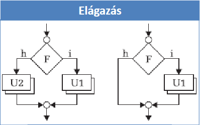

# 1. Programozás

## 1.1. Változok

| Típus         |    Formázókarakter     | Méret  |        Tartomány         | Megjegyzés                                                                               |
| ------------- | :--------------------: | :----: | :----------------------: | ---------------------------------------------------------------------------------------- |
| char          |         `"%c"`         | 1 byte |        -128...127        | Egy ASCII karakter.                                                                      |
| short         |  `"hd%"` vagy `"hi%"`  | 2 byte |      -32768...32767      | Egy 16 bitten tárol egésszám.                                                            |
| int           |   `"%d"` vagy `"%i"`   | 4 byte | -2147483648...2147483647 | Egy 32 bitten tárol egésszám.                                                            |
| long int      |  `"%ld"` vagy `"%li"`  | 4 byte | -2147483648...2147483647 | Egy 32 bitten tárol egésszám.                                                            |
| long long int | `"%lld"` vagy `"%lli"` | 8 byte | -2147483648...2147483647 | Egy 64 bitten tárol egésszám.                                                            |
| float         |         `"%f"`         | 4 byte |  kb. ±9*10<sup>18</sup>  | Egy 32 bitten tárol lebegőpontos szám.                                                   |
| double        |        `"%lf"`         | 4 byte |  kb. ±10<sup>309</sup>   | Egy 64 bitten tárol lebegőpontos szám.                                                   |
| char [n]      |         `"%s"`         | n byte |            -             | Egy karakterekből álló tömb. Még szokták nevezni **karakterlánc**nak vagy **string**nek. |
| <típus> *     |         `"%p"`         | 4 byte |            -             | Egy memmória cim. Még szokták nevezni **mutató**nak vagy **pointer**nek.                 |

Egy változónak le tudjuk kérni a címét a `&` operátorral.

## 1.2. Példák

```c++
int i;                          // Deklaráció (Nincs adva kezdeti érték.)
int d = 3;                      // Definicó (Van adva kezdeti érték.)
int o = 053;                    // 8-as számrendszerben van megadva.
int x = 0x16;                   // 16-as számrendszerben van megadva.
float f = 123.456;
double lf .6078;
char c = 'A';
char s[5] = "alma";             // A karakterlánc mérete eggyrl nagyobb kell legyen mint a bene levő betük száma.
char str[] = "Hello World!";    // Ha egyből adunk kezdeti értéket akkor nem szükséges megadni a tömb méretét, a fordító ki tudja találni.

int *ptr = &i;                  // Az 'i' változó cime elmentve az int mutató 'ptr' változóba.
```

## 1.3. Írás/Olvasás képernyőre

A képernyőről való olvasásra és a képernyőre való írásra vanak C függvények: `scanf("<formázósor>", <mutató>, <mutató>, ...);` és `printf("<formázósor>", <változó>, <változó>, ...);`


```c
int i;
printf("Kérem a számot:\n");
scanf("%i", &i);
printf("A szám: %i\n", i);
```

A képernyőről való olvasásra és a képernyőre való írásra vanak C++ függvények: `cin >> <változó>;` és `cout << <változó>;`

```c++
int i;
std::cout << "Kérem a számot:" << std::endl;
std::cin >> i
std::cout << "A szám: " << i << std::endl;
```

## 1.4. Feltételes utasítások

Párhuzamos forgatókönyvek. Egy feltétel szerint eldöntjük melyik uton haladunk tovább: if (`<feltétel>`) { `<utasítások>` } else { `<utasítások>` }



A feltételben összehasonlító operátorokat éehet használni, mint például: `==`, `!=`, `<`, `<=`, `>`, `>=`, stb.

```c++
/**
 * Írjunk egy programot amely meghatározza egy másodfokú polinom gyökeit: ax^2 + bx + c = 0.
 * Olvassuk be az a, b, c értékeket és száoljuk ki az x1-t és x2-t.
 **/
double a,b,c,delta,x1,x2;
scanf("%lf%lf%lf", &a ,&b, &c);
if (a != 0){
    delta = b*b – 4*a*c;
    if (delta >= 0) {
        x1 = (–b + sqrt(delta)) / (2*a);
        x2 = (–b – sqrt(delta)) / (2*a);
        printf("Gyokok: %.2lf, %.2lf", x1, x2);
    } else {
        printf("Komplex gyokok!");
    }
} else {
    printf("Nem masodfoku!");
}
```

**C89**: minden nem nulla numerikus érték logikai értéke IGAZ, a nulla pedig HAMIS. Lwhwt alkalmazni a boolalgebra alap logikai operátorait: `!` (NEM), `&&` (ÉS), `||` (VAGY).

|   A   |   B   | A && B | A \|\| B |
| :---: | :---: | :----: | :------: |
|   0   |   0   |   0    |    0     |
|   0   |   1   |   0    |    1     |
|   1   |   0   |   0    |    1     |
|   1   |   1   |   1    |    1     |

Egy kevésbé verbális elágazás a kérdőjel operátor: `<kif1>` ? `<kif2>` : `<kif3>`

```c++
int b =1 
printf( b ? "IGAZ\n" : "HAMIS\n" );
/**
 * if-else megfelelője:
 * if (B) {
 *      printf("IGAZ\n");
 * } else {
 *      printf("HAMIS\n");
 * }
```

Ha töbszörös elágazásra van szükség lehet használni a `switch` elágazást.

```c++
/**
 * switch (<kifejezés>){
 * case <konstans_1> : <utasítások>; [break;]
 * ...
 * case <konstans_n> : <utasítások>; [break;]
 * [ default <utasítások> ]
 * }
 **/
int jegy;
scanf(“%i”, &jegy);
switch (jegy){
    case 5 : printf(“jeles”); break;
    case 4 : printf(“jo”); break;
    case 3 : printf(“kozepes”); break;
    case 2 : printf(“elegseges”); break;
    case 1 : printf(“elegtelen”); break;
    default: printf(“nem jegy”);
}
```

## 1.5. Ciklusok

### 1.5.1. While ciklus

while ( `<feltétel>` ) { `<utasítások>` }
do { `<utasítások>` } while ( `<feltétel>` );


### 1.5.2. For ciklus

Általános alakja: for ( `<kif1>` ; `<kif2>` ; `<kif3>` ) { `<ciklus mag>` }. A `<kif1>` az az elöt fut le mielött belépünk a ciklusba, ezt használjuk inicializálásra. A `<kif2>` az a leállási feltétel. A `<kif3>` határozza meg hogy minden ciklus végén mit hajtsunk végre, például hányasával lépkedjünk.

### 1.5.3. Spéci kulcsszavak

`continue`: abbahagyja a jelenlegi ciklusmagot és kezdi a következőt.

`break`: abbahagyja a jelenlegi ciklusmagot és kilép a ciklusból.

`goto`: egy feltételnélküli ugrás valahová a kódba (ezt csak akkor jó használni, ha nem lehet megoldani a sehogyse másképp).

## 1.6. Függvények és metodusok

Deklaráció: `<típus>` `<azonosító>` (`<típus1>`, ..., `<típusN>`); A `<típus>` segítségével határozzuk meg hogy a függvényünk mit térit vissza. Az `<azonosító>` az egy teszőleges név amivel megtudjuk határozni az adott függvényt/metodust. A (`<típus1>`, ..., `<típusN>`) a paramétertípus lista.

Definició: `<típus>` `<azonosító>` (`<típus1>` `<név1>`, ..., `<típusn>` `<névn>`) { o; o; o; return `<eredmény>`; }

A deklaráció segítségével csak meghatározuk az adott függvény alakját, míg a definicó az konkrétan leírja az eljárást. Mielött hívatkoznunk egy függvényre egyszer kell legyen **deklarálva**.


## 1.3. Írás/Olvasás fileba

A szöveges álománykezelés nagyon hasonlít a standard ki/be-menet kezelésére. A különbség hogy elöbb meg kell nyissuk a fájlt.

ANSI C-ben a fájlokat egy `FILE *` mutaó segítségével tudjuk tárolni. Az `fopen()` függvény segítségével nyissuk meg, és az `fclose()` függvény segítségével zárjuk be.

```C
#include <cstdio>

int main(int argc, char const *argv[]) {
    FILE *fin; //állománypointer (választhatsz más nevet is)
    fin = fopen("<állománynév>", "rt");
    if(!fin){
        printf("Sikertelen allomanymegnyitas!\n\r");
        return 1;
    }
    •••
    fscanf(fin, "<formázósor>", <változócímlista>);
    •••
    fclose(fin);

    return 0;
}
```

```C
#include <cstdio>

int main(int argc, char const *argv[]) {
    FILE *fout; //állománypointer (választhatsz más nevet is)
    fout = fopen("<állománynév>", "wt");
    if(!fout){
        printf("Sikertelen allomanymegnyitas!\n\r");
        return 1;
    }
    •••
    fprintf(fout, "<formázósor>", <kifejezéslista>);
    •••
    fclose(fout);

    return 0;
}
```

ANSI C-ben a fájlokat egy `fstream` (`ifstream` vagy `ofstream`) típus segítségével tudjuk tárolni. Az `fstream` típus rendelkezik egy `.open()` metodussal, ami segítségével meg nyissuk, és az `.close()` metódus segítségével zárjuk be.

```C++
#include <iostream>
#include <fstream>

int main(int argc, char const *argv[]) {
    int x; double y;
    •••
    ifstream fin;
    fin.open ("<állománynév>");
    if(!fin.is_open()){
        std::cout << "Sikertelen allomanymegnyitas!" << std::endl;
        return 1;
    }
    •••
    fin >> x >> y;
    •••
    fin.close();

    return 0;
}
```

```C++
#include <iostream>
#include <fstream>

int main(int argc, char const *argv[]) {
    ofstream fout;
    fout.open ("<állománynév>");
    if(!fout.is_open()){
        std::cout << "Sikertelen allomanymegnyitas!" << std::endl;
        return 1;
    }
    •••
    fout << "Fájlba való kiíratás" << std::endl;
    •••
    fout.close();

    return 0;
}
```

Példa küdrészlet, ami fájl végéig beolvas szavakat:

```C
for( i = 0 ; fscanf(fin, “%s”, szo) != EOF ; ++i ){
    •••
}
```

```C
for(i = 0 ; !fin.eof() ; ++i){
    fin >> •••;
    •••
}
```

Például ha egy olyan programot akarunk tesztelni ami a billentyüzetről olvas és a képernyőre ír de szeretnénk automatizálni a teszteleést akkor a `freopen` segítségével tudjuk ezt megcsinálni. Ez átírányítja a fájlt egy adott adatfolyamra: `stdin` (billentyüzet) vagy `stdout` (lépernyő).

```C
// Áttírányítunk egy filet a standard bemenetre (a billentyüzet helyet a fájlból olvasól).
freopen("be.txt", “rt”, stdin);
// Áttírányítunk egy filet a standard kimenetre (a képernyő helyett a fájlba).
freopen("ki.txt", “wt”, stdout);
```

## Tömbök

Egy tömb dklarálása `<elemtípus>` `<azonosító>`[`<elemszám>`];


```C++
// Példák deklarációra és definicióra.
int a[100];
double x[10], y, z[50];
short b[5] = { 11, 22, 33, 44, 55 };
long c[1000] = { 0 }, d[50] = { 1 };
char s[5] = { 'a', 'b', 'c', 'd', 'e', 'f' };
int w[] = { 1, 2, 3, 4, 5, 6, 7, 8, 9, 10 };
```

Példa beolvasásra:

```C++
// Egydimenziós tömb beolvasása.
int main() {
    freopen(“szamsor.txt”, “r”, stdin);
    int n, a[100];
    std::cin >> n; // vagy: scanf(“%i”, &n);
    for(int i = 0; i < n; ++i) { // generálja i-ben az
        std::cin >> a[i]; // scanf(“%i”, &a[i]); // 0,1,...,n-1 index-sort
    }
    •••
    return 0;
}

// Két dimenziós tömb beolvasása
int main() {
    freopen(“szamsor.txt”, “r”, stdin);
    int n, a[100][100];
    std::cin >> n; // vagy: scanf(“%i”, &n);
    for(int i = 0; i < n; ++i) { // generálja i-ben az
        for(int j = 0; j < n; ++j) { // generálja j-ben az
            std::cin >> a[i][j];
        }
    }
    •••
    return 0;
}
```

